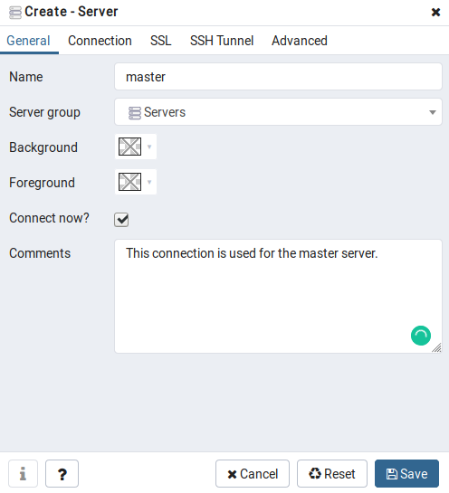
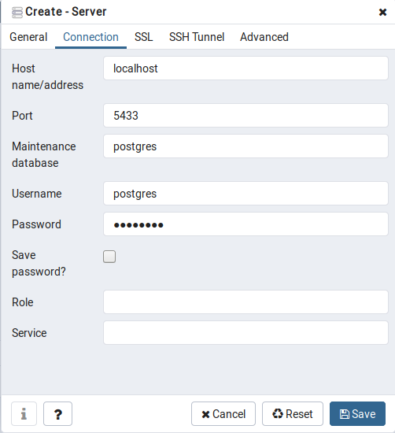
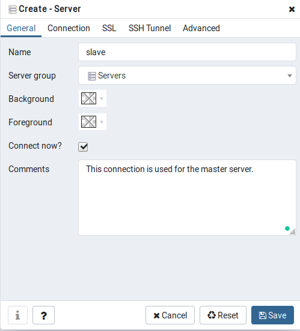
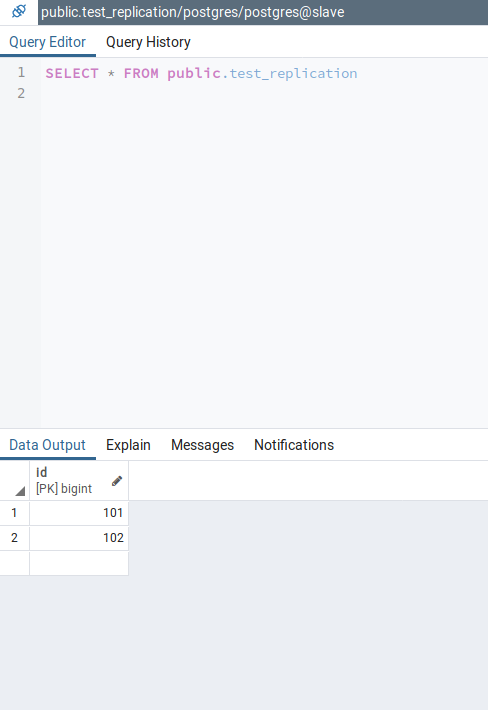

# postgresql-replication

## PostgreSQL Streaming Replication With Docker and docker-compose

### Requirements :
Following dependencies needs to be installed on the machine
<ul style="list-style-type:circle">
  <li>1. Docker</li>
  <li>2. docker-compose</li>
  <li>3. PgAdmin</li>
</ul>

<b>Optional :</b><br><br>
You can create your own docker image. Use following command to create one. <br><br>
`docker image build -t postgresql-replication` <br><br>
After this, you need to modify the image name in docker-compose.yml file.

<b>Plan of execution</b><br><br>
<b>1. Run the docker images using docker-compose</b><br><br>
```docker-compose up```
<br><br>
<b>2. Use PgAdmin to log into the databases</b><br><br>
We need to add two servers into the PgAdmin one is for master server and another is for slave server.<br><br>
<b>2.1 Adding master server</b></br><br>
<br>
<br><br>
<b>2.2 Adding slave server</b></br><br>
<br>
<br><br>

<b>3. Create any table in <b>master server<b/> and check the same in the slave server</b><br><br>
  
```
CREATE TABLE test_replication (id int);
INSERT INTO public.test_replication values (101);
INSERT INTO public.test_replication values (102);
```

<b>4. Check the same table in the slave server</b><br><br>
```SELECT * FROM test_replication;```

<br><br>

